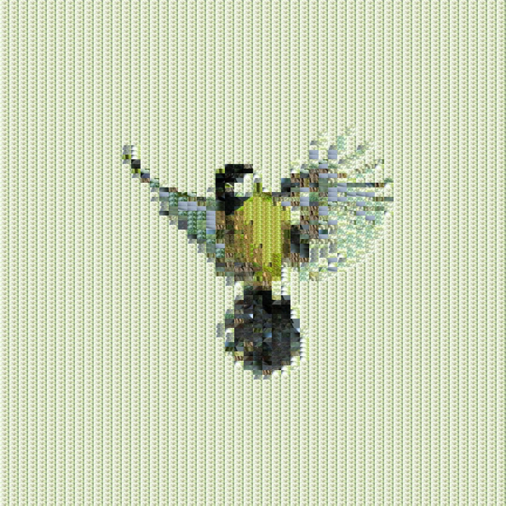

# AverageSearchImageMatching

This project reconstructs an input image using sections of another image (the map). The selection process is based on a [distance](https://processing.org/reference/dist_.html)
function that compares RGB values of the pixels making up the images, treating them as x, y, and z coordinates. A lower distance means a better match.

# Adjustable Parameters
## Sliders:
-	Resolution – Controls accuracy by adjusting how thoroughly the map is searched for matches (higher = more detailed, lower = faster).
-	Grid Width (X) – Defines the number and width of grid squares in both the input and map images.
-	Grid Height (Y) – Defines the number and height of grid squares in both the input and map images.

## Toggles:
- Allow Reuse (tog1) – Enables/disables whether sections of the map can be reused multiple times in the reconstruction.
- Swap Images (tog2) – Switches which image is treated as the input and which is the map.
   
## Saving Output
To save the reconstructed image, uncomment the following line in the code:
```processing
// saveFrame("frame.jpg");
```
## Custom Images
To use your own images, add them to the "data" folder and update the file path in the code:
```processing
loadImage("YourFileName.jpg");
```



